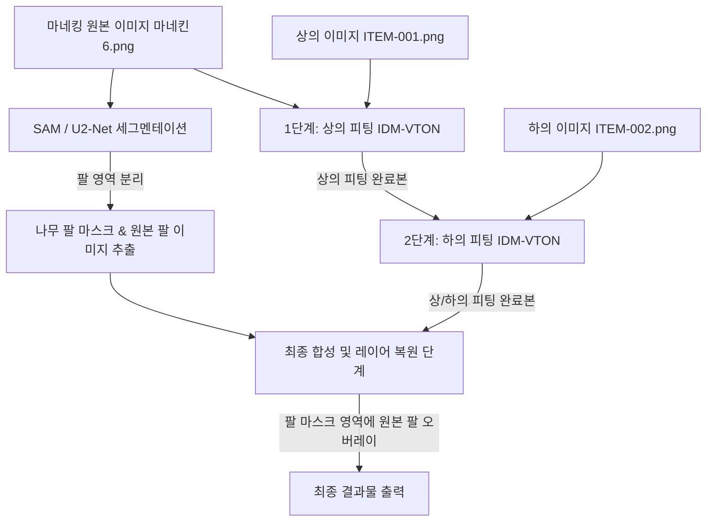

# 마네킹 AI 가상 피팅 시스템 구축 계획서
(System Construction Plan for Mannequin AI Virtual Try-On)

본 계획서는 마네킹 이미지(`마네킨6.png`)에 상의 의류(`ITEM-001.png`)와 하의 의류(`ITEM-002.png`)를 순차적으로 피팅하고, 마네킹 고유의 나무 팔 형태를 원본 그대로 보존하기 위한 로컬 GPU 기반 가상 피팅 시스템 구축 방안을 제시합니다.

---

## 1. 시스템 개요 및 목적
* **목적**: 의류 상품의 플랫 이미지(Flat Lay)를 마네킹에 핏에 맞게 자연스럽게 합성하여 가상 착장 이미지를 생성합니다.
* **주요 과제**:
  1. 마네킹 고유의 자세와 나무 팔(Wooden Arms) 레이어가 의류 이미지 위에 자연스럽게 겹치도록(Overlay) 마스킹 처리.
  2. 상의와 하의를 왜곡 없이 순차적으로 피팅(Sequential Fitting)하여 한 번에 위아래를 모두 입은 최종 완성본 도출.
  3. 로컬 GPU 자원을 활용하여 외부 API 비용 없이 빠르고 독립적으로 구동 가능한 시스템 구축.

---

## 2. 시스템 아키텍처 및 기술 스택

### 2.1. 인프라 및 실행 환경
* **하드웨어 요구사항**: NVIDIA GPU (VRAM 12GB 이상 권장, PyTorch 가속 필수)
* **OS**: Windows / Linux
* **구동 아키텍처**: 로컬 PC 내 단독 구동 Python 환경

### 2.2. 주요 기술 스택
* **Language**: Python 3.10+
* **Deep Learning Framework**: PyTorch, Diffusers, Transformers
* **Virtual Try-On Core**: IDM-VTON (또는 OOTDiffusion full-body 모델)
* **Segmentation (Masking)**: SAM (Segment Anything Model) 또는 U2-Net (팔 영역 분할용)
* **Image Processing**: OpenCV, Pillow (PIL), NumPy
* **User Interface**: Gradio (또는 Streamlit) 기반 로컬 웹 UI

---

## 3. AI 피팅 파이프라인 설계

시스템은 아래의 순서로 동작하는 **2단계 순차 피팅(Sequential Fitting) 및 팔 레이어 복원(Arm Overlay) 파이프라인**을 따릅니다.

### 3.1. 1단계: 마네킹 팔 영역 마스킹 추출 (Pre-processing)
마네킹 이미지에서 의류 뒤로 숨겨지면 안 되는 **나무 팔 영역**의 마스크를 생성합니다.
* **기술**: SAM(Segment Anything Model)에 포인트 프롬프트(예: 팔 부분 좌표)를 제공하거나, U2-Net을 활용하여 나무 재질의 팔 영역 세그멘테이션 마스크($M_{arm}$)를 생성합니다.
* **추출 정보**:
  * $I_{arm\_origin}$: 원본 이미지에서 팔 영역만 추출하고 배경은 투명화한 이미지.
  * $M_{arm}$: 팔 영역은 255(흰색), 나머지는 0(검은색)인 이진 마스크.

### 3.2. 2단계: 상의 피팅 (Upper-Body Fitting)
* **입력**: 마네킹 원본 이미지 ($I_{mannequin}$), 상의 이미지 ($I_{top}$)
* **모델**: IDM-VTON (상의 카테고리 적용)
* **출력**: 상의가 피팅된 중간 결과 이미지 ($I_{step1}$)

### 3.3. 3단계: 하의 피팅 (Lower-Body Fitting)
* **입력**: 2단계 결과 이미지 ($I_{step1}$), 하의 이미지 ($I_{bottom}$)
* **모델**: IDM-VTON (하의 카테고리 적용)
* **출력**: 상/하의가 모두 피팅된 이미지 ($I_{step2}$)

### 3.4. 4단계: 나무 팔 레이어 복원 (Post-processing)
피팅 결과 이미지 $I_{step2}$ 위에 1단계에서 보존해 둔 원본 팔 이미지 $I_{arm\_origin}$를 마스크 $M_{arm}$을 기준값으로 오버레이합니다.
$$\text{Final Image} = I_{step2} \times (1 - M_{arm}) + I_{arm\_origin} \times M_{arm}$$
이 과정을 통해 옷의 핏은 마네킹 체형에 맞춰지면서도, 팔이 옷 앞쪽으로 자연스럽게 배치되는 최종 결과 이미지를 얻을 수 있습니다.

---

## 4. 로컬 웹 사용자 인터페이스 (Gradio UI Design)

Gradio를 활용한 직관적인 웹 GUI는 다음과 같이 구성됩니다.

1. **입력 패널 (Left)**
   * 마네킹 이미지 업로드 (기본값: `마네킨6.png` 자동 로드 가능)
   * 상의 이미지 업로드 (`ITEM-001.png`)
   * 하의 이미지 업로드 (`ITEM-002.png`)
2. **설정 및 제어 패널 (Center)**
   * 피팅 모드 선택: `상하의 전체 (순차)`, `상의만`, `하의만`
   * 팔 복원 오버레이 활성화 여부 토글 스위치 (기본값: ON)
   * `피팅 시작 (Generate)` 버튼
3. **출력 패널 (Right)**
   * 최종 피팅이 완료된 결과 이미지 표시
   * 이미지 다운로드 버튼

---

## 5. 검증 및 테스트 계획

### 5.1. 정량적 검증 (Quantitative Verification)
* **세그멘테이션 정확도**: SAM/U2-Net이 생성한 팔 마스크의 IoU(Intersection over Union)가 0.93 이상인지 검증.
* **추론 속도**: 로컬 GPU(RTX 3060/4060 이상 기준)에서 1회 전체 파이프라인 구동 시 소요 시간이 30초 이내인지 측정.

### 5.2. 정성적 검증 (Qualitative Verification)
* **경계면 자연스러움**: 팔 오버레이 경계면에 흰색 테두리나 계단 현상(Aliasing)이 생기지 않는지 확인.
* **의류 핏 훼손 여부**: 의류의 목선, 소매, 바지 밑단이 마네킹 외곽선을 벗어나거나 지나치게 늘어나지 않는지 확인.
